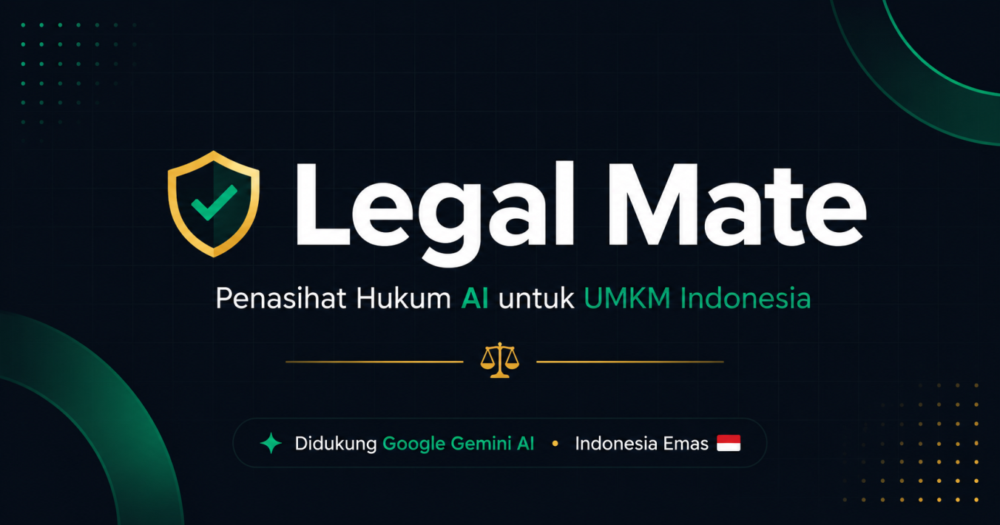

  

# Legal Mate

### AI-Powered Contract Analyzer & UMKM Protection Platform

Protecting small businesses from risky agreements, unfair contracts, and harmful actors using AI.

---

## 📖 About The Project

**Legal Mate** is a web platform designed to help **UMKM (Micro, Small, and Medium Enterprises)** analyze contracts and agreements to reduce potential financial and legal risks.

The platform is powered by an AI assistant named **Sada**, built on top of the **Gemini** model. Users can upload or review agreements and receive AI-assisted insights about suspicious clauses, potential dangers, and important legal considerations.

Besides contract analysis, Legal Mate also provides a **community-driven blacklist/report system**, where users can report companies or individuals that have previously harmed UMKM businesses. This helps other users stay cautious and make safer decisions before entering partnerships or agreements.

This project was created for the **Vincoo Hackathon 2026**.

---

## ✨ Features

- 🤖 AI-powered contract analysis using **Sada**
- 📄 Detect potentially harmful or suspicious agreement clauses
- ⚠️ Risk awareness system for UMKM users
- 🛡️ Community blacklist/report platform
- 🏢 Report problematic companies or individuals
- 🔍 Improve transparency and business safety
- 🌐 Modern web-based interface

---

## 🧠 About Sada

**Sada** is the AI assistant integrated into Legal Mate.

It uses the **Gemini** AI model to help users:
- Understand complicated contract language
- Identify risky sections inside agreements
- Highlight important legal concerns
- Improve awareness before signing contracts

The goal of Sada is not to replace professional legal consultation, but to make legal understanding more accessible for small businesses and independent entrepreneurs.

---

## 🎯 Mission

Many UMKM businesses suffer losses because they:
- Do not fully understand legal agreements
- Lack access to legal experts
- Trust the wrong business partners

Legal Mate aims to reduce those risks by making contract analysis and business transparency more accessible through AI technology.

---

## 📌 Disclaimer

Legal Mate is an AI-assisted platform and does not replace professional legal advice. Always consult a qualified legal professional for critical legal matters.

---

Made with passion for UMKM protection ❤️

